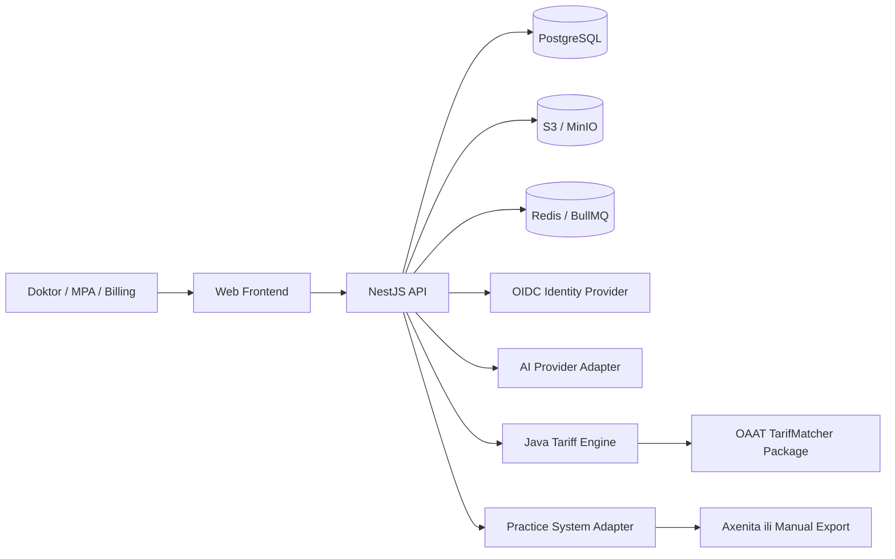
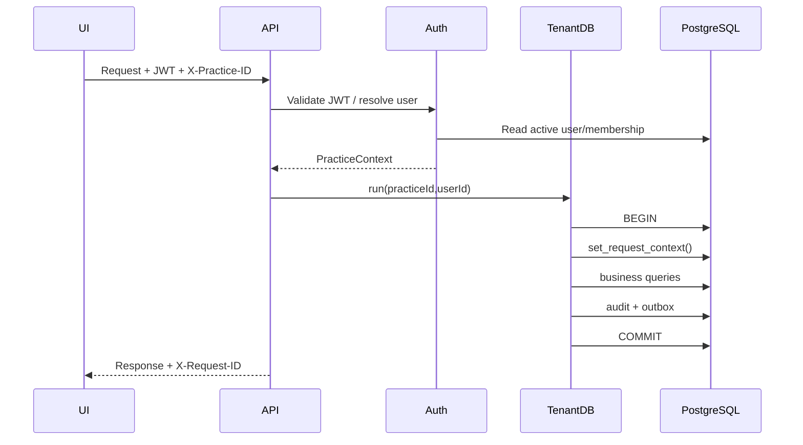
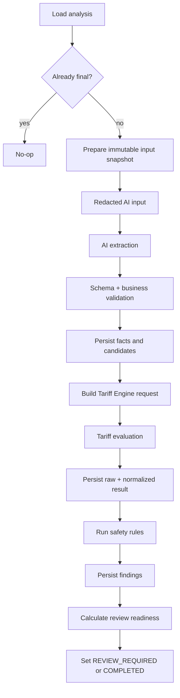

# 01 — Backend Architecture v1

**Projekt:** Auditabilni Axenita TARDOC Billing Safety Copilot  
**Verzija:** 1.0  
**Status:** BASELINE FOR MVP  
**Arhitektonski stil:** Modularni monolit + izolovani Tarif Engine servis

---

# 1. Cilj arhitekture

Arhitektura mora omogućiti izradu prvog auditabilnog MVP-a bez nepotrebne distribuirane složenosti. Sistem treba biti:

- dovoljno jednostavan da ga mala razvojna ekipa može održavati;
- dovoljno strogo strukturiran da se sigurnost ne oslanja samo na disciplinu developera;
- spreman za integraciju sa Axenitom, ali nezavisan od još nedostupnog API ugovora;
- spreman za OAAT TarifMatcher, ali sposoban da radi sa mock servisom;
- reproducibilan;
- tenant-aware;
- auditabilan;
- testabilan;
- verzionisan.

---

# 2. Arhitektonski ciljevi

## 2.1 Funkcionalni ciljevi

Backend mora podržati:

1. organizacije/prakse i članstva;
2. pseudonimizovane pacijentske reference;
3. encounter i dokumente;
4. analysis revisions;
5. AI extraction;
6. LKAAT candidates;
7. tarifnu evaluaciju;
8. safety findings;
9. ljudski review;
10. approval snapshot;
11. manual/Axenita draft export;
12. audit package;
13. verzionisane tarifne pakete;
14. asinhrone poslove;
15. administrativnu konfiguraciju.

## 2.2 Quality atributi

Prioritet:

1. zaštita podataka;
2. tenant izolacija;
3. integritet/audit;
4. tačnost state machinea;
5. testabilnost;
6. operativna pouzdanost;
7. jednostavnost razvoja;
8. performanse;
9. horizontalno skaliranje.

Performanse nisu važnije od integriteta i reproduktivnosti.

---

# 3. Non-goals MVP-a

MVP ne uključuje:

- kompletan EHR;
- appointment scheduling;
- voice bot;
- automatski konačni billing;
- payment collection;
- data warehouse;
- ML training pipeline nad korisničkim podacima;
- multi-region active-active;
- event sourcing framework;
- kompleksan no-code rule builder;
- puni FHIR server;
- vlastiti tarifni kalkulator;
- mobile-first approval.

---

# 4. Kontekst dijagram



---

# 5. Deployment jedinice

## 5.1 `apps/api`

Odgovornosti:

- REST API;
- auth;
- practice context;
- permissions;
- business orchestration;
- database access;
- outbox publisher;
- queue producer;
- worker processors u početnoj fazi;
- external adapters;
- OpenAPI.

Kasnije se isti codebase može pokrenuti u dva moda:

```text
API_MODE=http
API_MODE=worker
```

To nije poseban mikroservis nego odvojeni proces istog deployment artefakta.

## 5.2 `services/tariff-engine-java`

Odgovornosti:

- učitavanje dozvoljene OAAT verzije;
- validacija request contracta;
- pozivanje CaseMaster/Grouper/Mapper;
- normalizacija odgovora;
- raw result;
- health/release status.

Ne odgovara za:

- korisnike;
- tenant autorizaciju;
- medicinske dokumente;
- approval;
- Axenita;
- audit UI.

## 5.3 PostgreSQL

Source of truth za:

- identitet aplikacijskog korisnika;
- tenant membership;
- poslovne entitete;
- job status;
- outbox;
- audit metadata;
- konfiguracione verzije.

## 5.4 Redis

Koristi se za:

- BullMQ queue;
- distributed job coordination;
- eventualno rate-limit storage.

Ne koristi se za:

- medicinski sadržaj;
- approval payload;
- trajni status;
- audit source of truth.

## 5.5 Object storage

Koristi se za:

- uploadovane dokumente;
- enkriptovane raw AI artefakte;
- raw tarifne pakete;
- audit PDF;
- import/export artefakte.

---

# 6. NestJS modulna arhitektura

```text
src/
├── bootstrap/
├── common/
├── config/
├── database/
├── auth/
├── practices/
├── users/
├── patients/
├── encounters/
├── documents/
├── tariffs/
├── analyses/
├── ai-extraction/
├── tariff-engine/
├── safety-rules/
├── reviews/
├── approvals/
├── integrations/
├── exports/
├── audit/
├── jobs/
├── outbox/
└── health/
```

## 6.1 `common`

Sadrži samo cross-cutting tehničke elemente:

- base error code;
- Problem Details filter;
- request ID;
- pagination;
- decorators;
- permission guard;
- redaction helpers;
- hash/canonical JSON helper;
- clock abstraction.

Ne smije postati "miscellaneous" folder za business logiku.

## 6.2 `database`

- PrismaService;
- TenantDatabaseService — **kanonski facade koncept** tenant database granice. Konkretna klasa je
  **uslovno odgođena (D-056, dio A)**: uvodi se tek kada stvarni tenant business modul zatraži tu
  apstrakciju, i tada mora biti **tanak facade** nad postojećom pinovanom transakcijom, uz ponovni
  dokaz D-054, klauzula 6–10. Do tada tu granicu nosi `TenantRequestPipeline`;
- transaction helpers;
- database health;
- controlled raw SQL helpers.

## 6.3 `auth`

- JWT validation;
- user resolution;
- current user;
- practice context;
- permission evaluation.

## 6.4 `encounters`

- encounter lifecycle;
- diagnoses;
- state machine;
- list/detail.

## 6.5 `documents`

- manual text;
- presigned upload;
- normalization;
- redaction;
- encryption;
- content access audit.

## 6.6 `tariffs`

- tariff release catalog;
- activation;
- artefacts;
- admin endpoints.

## 6.7 `analyses`

- analysis lifecycle;
- revision;
- input snapshot;
- pipeline orchestration;
- workspace aggregation.

## 6.8 `ai-extraction`

- provider interface;
- mock provider;
- real provider adapters;
- output schema validation;
- facts/candidates mapping.

## 6.9 `tariff-engine`

- internal HTTP client;
- request/response schemas;
- timeout/retry;
- normalization.

## 6.10 `safety-rules`

- rule interface;
- registry;
- version metadata;
- finding creation;
- approval blocking policy.

## 6.11 `reviews` i `approvals`

- corrections;
- finding resolution;
- acknowledgement;
- approval readiness;
- immutable approval snapshot;
- revocation.

## 6.12 `integrations` i `exports`

- adapter registry;
- ManualAdapter;
- Axenita adapter stub;
- connection configuration;
- export jobs.

## 6.13 `audit`

- append-only audit events;
- timeline;
- audit package;
- integrity chain, ako se aktivira.

## 6.14 `outbox` i `jobs`

- transaction outbox;
- publisher;
- queue registration;
- processors;
- retry/failure.

---

# 7. Slojevi unutar feature modula

Preporučena struktura:

```text
feature/
├── controllers/
├── dto/
├── application/
├── domain/
├── repositories/
├── mappers/
├── policies/
├── feature.module.ts
└── feature.constants.ts
```

## 7.1 Controller

Radi:

- HTTP parsing;
- DTO;
- current context;
- status/header;
- poziva application service.

Ne radi:

- Prisma query;
- state transition;
- hashiranje;
- permission business logic;
- external API call.

## 7.2 Application service

Orkestrira use case:

- tenant transaction;
- domain validation;
- repository;
- audit;
- outbox;
- response mapping.

## 7.3 Domain

Sadrži:

- state transition;
- approval policy;
- finding severity policy;
- value object validaciju;
- business invariants.

Ne zavisi od Express requesta.

## 7.4 Repository

Sadrži:

- Prisma upite;
- kontrolisani raw SQL;
- row lock helper;
- query composition.

## 7.5 Adapter/client

Izoluje:

- AI;
- Tarif Engine;
- S3;
- OIDC;
- Axenita.

---

# 8. Glavni request flow



---

# 9. Analysis pipeline

## 9.1 HTTP command

`POST /encounters/{id}/analyses`:

- validira encounter;
- bira tariff release;
- određuje revision number;
- kreira analysis;
- kreira async job;
- kreira outbox;
- vraća `202`.

## 9.2 Outbox publisher

- učitava unpublished evente;
- zaključava `SKIP LOCKED`;
- enqueue u BullMQ;
- označava published;
- tolerira retry.

## 9.3 Processor



## 9.4 Pipeline checkpointi

Svaki korak ima idempotency checkpoint:

| Korak | Check |
|---|---|
| Snapshot | unique `analysis_run_id` |
| AI run | status `SUCCEEDED` + request hash |
| Facts | tied to extraction run |
| Tariff eval | unique `analysis_run_id` |
| Findings | unique analysis + rule version + code |
| Completion | allowed state transition |

---

# 10. Tenant isolation arhitektura

Tenant isolation nije samo middleware filter.

Koristi se defense in depth:

1. JWT user;
2. membership lookup;
3. `X-Practice-ID`;
4. PracticeContext;
5. TenantDatabaseService;
6. `set_request_context`;
7. RLS;
8. composite FK;
9. integration test;
10. audit.

Slojevi 4 i 5 su **semantičke odgovornosti**, ne obavezna imena klasa (D-054, klauzule 2–5;
D-056, dio A). Sloj 4 je faza tenant admisije i uspostave konteksta; sloj 5 je tenant database
granica — jedan `PrismaService`, **jedna** pinovana interaktivna transakcija i `set_request_context`
unutar nje. Na kanonskom `main`-u oba nosi `TenantRequestPipeline`. **Konkretna klasa
`TenantDatabaseService` je uslovno odgođena** i postaje obavezna tek kada stvarni tenant business
modul zatraži tu apstrakciju; nijedan sloj ovim nije uklonjen ni oslabljen.

## 10.1 Zašto RLS

Application filter može biti zaboravljen u jednom queryju. RLS daje database-level zaštitu.

## 10.2 Zašto composite FK

Čak i kada oba reda postoje, baza mora spriječiti povezivanje encountera iz practice A sa patientom iz practice B.

## 10.3 Worker context

Worker job nosi `practiceId`, ali ga ne smatra automatski pouzdanim. Worker:

- učitava job/analysis kroz kontrolisani sistemski tok;
- postavlja tenant context;
- izvršava tenant query;
- ne koristi unrestricted owner role.

---

# 11. Auth i autorizacija

## 11.1 Authentication

Produkcija: OIDC/JWT.

Backend validira:

- signature;
- issuer;
- audience;
- expiration;
- subject.

## 11.2 User resolution

Token `sub` mapira se na `users.auth_subject`.

Inactive user se odbija.

## 11.3 Authorization

Permission model:

```text
role → permissions
```

U MVP-u mapiranje može biti statičko u kodu, uz membership role u bazi.

Kasnije se može normalizovati u tabele ako poslovna potreba opravda.

---

# 12. Dokumenti i enkripcija

## 12.1 Vrste podataka

- original file;
- normalized text;
- redacted text;
- source hash;
- redacted hash;
- storage metadata.

## 12.2 Preporučeni flow

```text
upload/manual text
→ normalize
→ source hash
→ encrypt/store original
→ redact identifiers
→ redacted hash
→ encrypt/store redacted
→ document metadata
```

## 12.3 Čitanje

Originalni tekst se vraća samo uz posebnu permission i stvara `DOCUMENT_VIEWED` audit event.

---

# 13. External adapter arhitektura

## 13.1 AI

```ts
interface AiExtractionProvider {
  extractFacts(input: AiExtractionInput): Promise<AiExtractionResult>;
}
```

Implementacije:

- Mock;
- OpenAI/Azure/odabrani provider;
- budući lokalni model.

## 13.2 Practice system

```ts
interface PracticeSystemAdapter {
  testConnection(...): Promise<...>;
  importEncounter(...): Promise<...>;
  importDocuments(...): Promise<...>;
  importBillingDraft(...): Promise<...>;
  exportApprovedBillingDraft(...): Promise<...>;
  attachAuditSummary(...): Promise<...>;
}
```

Implementacije:

- ManualAdapter;
- CsvAdapter;
- AxenitaSandboxAdapter;
- AxenitaProductionAdapter.

## 13.3 Tariff Engine

```ts
interface TariffEngineClient {
  evaluate(request): Promise<response>;
  health(): Promise<health>;
  releases(): Promise<release[]>;
}
```

---

# 14. Resilience

## 14.1 Timeout

Svaki external call ima:

- connect timeout;
- total timeout;
- request ID;
- kontrolisani error code.

## 14.2 Retry

Retry samo kada je operacija idempotentna.

| Greška | Retry |
|---|---|
| network reset | da, ograničeno |
| timeout | da, ograničeno |
| 502/503/504 | da |
| 400 | ne |
| 401/403 | ne automatski |
| schema mismatch | ne |
| business validation | ne |

## 14.3 Circuit breaker

Nije obavezan u prvoj fazi, ali client mora biti izolovan tako da se može dodati.

## 14.4 Partial failure

Ako AI uspije, a Tarif Engine padne:

- AI run ostaje spremljen;
- analysis status je tariff failure;
- retry ne poziva AI ponovo ako input/prompt hash nije promijenjen.

---

# 15. Observability

## 15.1 Logs

Strukturirani JSON:

- timestamp;
- level;
- service;
- environment;
- requestId;
- practiceId UUID;
- userId UUID;
- encounterId;
- analysisId;
- jobId;
- action;
- errorCode;
- durationMs.

## 15.2 Metrics

Minimalno:

- HTTP request count/latency/error;
- active DB connections;
- queue depth;
- job success/failure/retry;
- AI latency/errors;
- Tarif Engine latency/errors;
- analysis completion duration;
- approval count;
- export failure count.

## 15.3 Tracing

OpenTelemetry je preporučen prije pilota, ali trace attributes ne smiju sadržavati medicinski sadržaj.

---

# 16. Scaling plan

MVP:

- 1 API instance;
- 1 worker instance;
- 1 Java engine;
- managed ili container PostgreSQL;
- Redis;
- object storage.

Prvi scaling koraci:

1. više API replika;
2. odvojeni worker;
3. concurrency po queueu;
4. DB connection pool tuning;
5. više Java engine replika;
6. read optimization za dashboard.

Nije potreban database sharding.

---

# 17. Failure modes

## 17.1 PostgreSQL unavailable

- readiness fail;
- API write rute nisu dostupne;
- ne pokušavati "offline writes".

## 17.2 Redis unavailable

- HTTP command i outbox mogu se commitovati;
- publisher retrya kasnije;
- analysis ostaje queued u DB-u.

## 17.3 AI unavailable

- analysis extraction failed/retryable;
- nema silent fallbacka na izmišljene rezultate.

## 17.4 Tariff Engine unavailable

- analysis tariff failed/retryable;
- nema approvala bez validnog rezultata, osim buduće eksplicitne policy odluke.

## 17.5 Object storage unavailable

- upload/čitanje dokumenta fail;
- ne spremati veliki dokument privremeno u log ili Redis.

## 17.6 Axenita unavailable

- export job failed;
- approval ostaje validan;
- retry koristi isti payload hash.

---

# 18. Security boundaries

| Boundary | Kontrola |
|---|---|
| Browser → API | TLS, JWT, CORS, validation |
| API → PostgreSQL | runtime role, RLS, TLS |
| API → Redis | private network, auth/TLS u produkciji |
| API → S3 | scoped credentials, encryption |
| API → AI | redaction, minimal input, DPA |
| API → Tariff Engine | private network, service auth |
| API → Axenita | scoped credentials, audit, timeout |
| Admin operation | stronger permission, audit |

---

# 19. Arhitektonske odluke koje su još otvorene

- produkcijski OIDC provider;
- cloud/Swiss hosting provider;
- KMS;
- AI provider;
- retention;
- raw AI response retention;
- Axenita contract;
- OAAT package loading/licensing;
- PDF generator;
- exact worker deployment separation.

Evidencija je u `docs/13_OPEN_QUESTIONS_AND_EXTERNAL_DEPENDENCIES.md`.

---

# 20. Arhitektonski acceptance kriteriji

Arhitektura je pravilno implementirana kada:

- core domen radi sa mock external providerima;
- Axenita-specific DTO ne ulazi u core modele;
- Tariff Engine se može zamijeniti mockom;
- AI provider se može zamijeniti mockom;
- tenant query u business modulima ne može zaobići tenant database granicu — jednu pinovanu
  interaktivnu transakciju sa uspostavljenim tenant kontekstom; tamo gdje business modul koristi
  konkretan `TenantDatabaseService` facade, taj facade zadovoljava D-054, klauzule 6–10 (D-056);
- RLS testovi prolaze;
- HTTP command je odvojen od teškog workera;
- approval snapshot je immutable;
- export koristi approval snapshot;
- audit može rekonstruisati workflow.
