# 14 — Data Flow and Sequence Diagrams

Mermaid dijagrami služe kao tehnički vodič. Kod/state machine i autoritativni dokumenti imaju prednost ako dođe do razlike.

---

# 1. Sistem

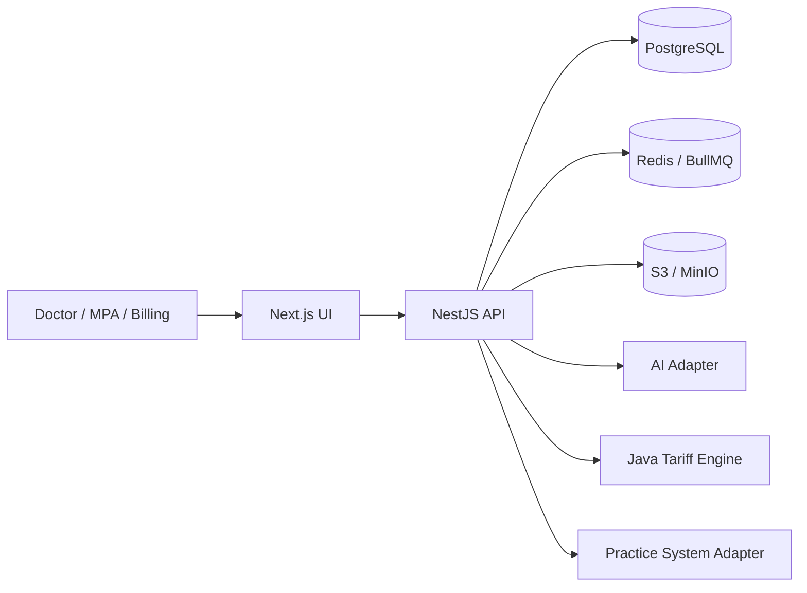

---

# 2. Tenant request

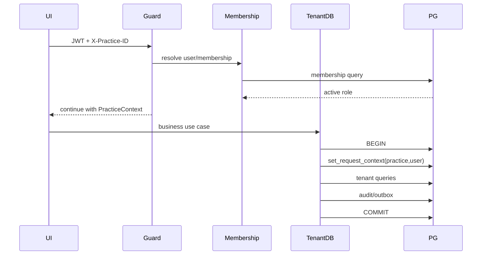

---

# 3. Create encounter

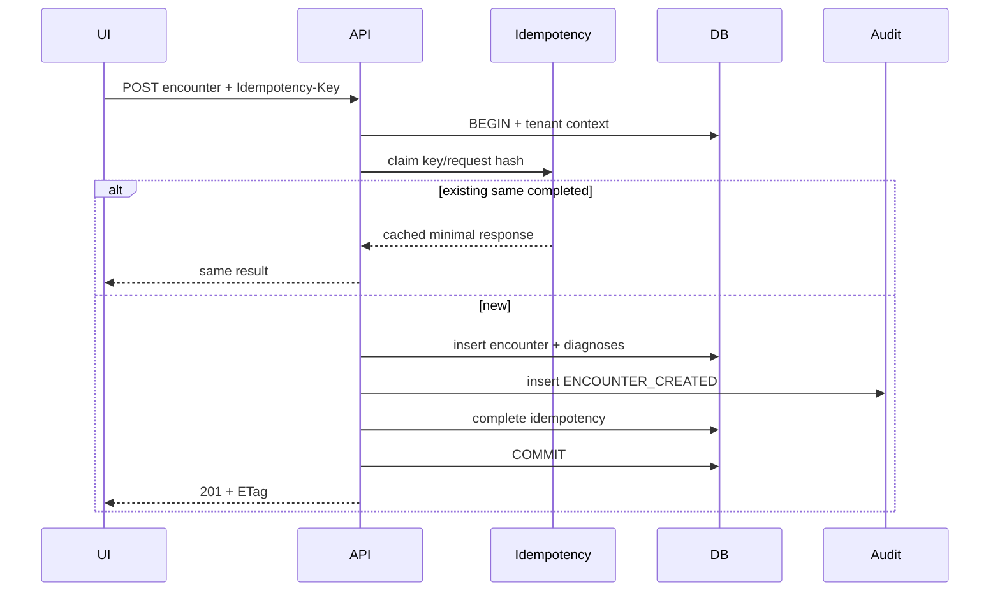

---

# 4. Document intake

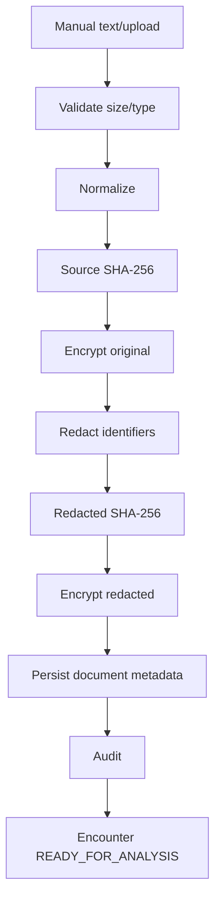

---

# 5. Analysis command/outbox

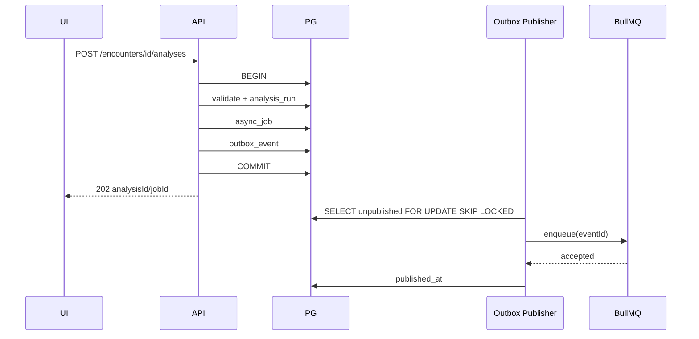

---

# 6. Analysis pipeline

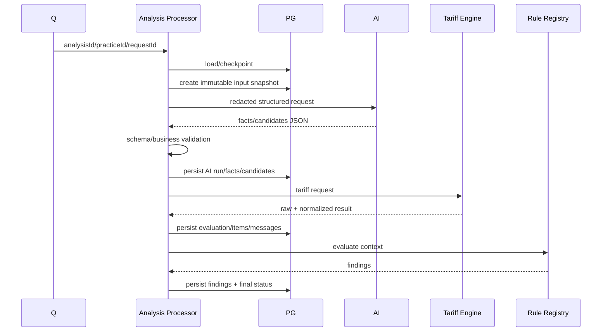

---

# 7. Retry checkpoint

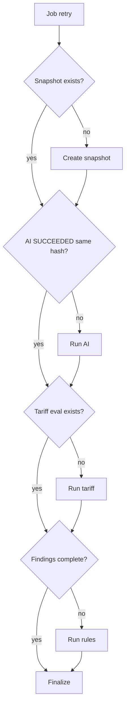

---

# 8. Review/correction

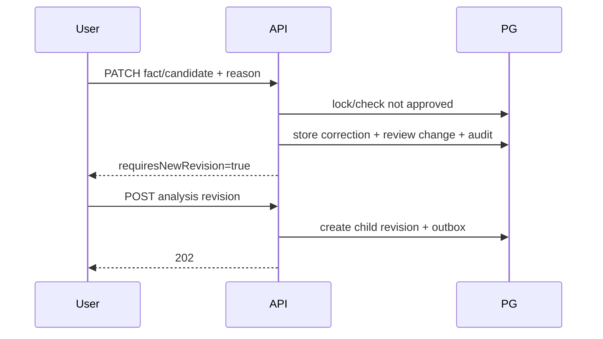

---

# 9. Approval

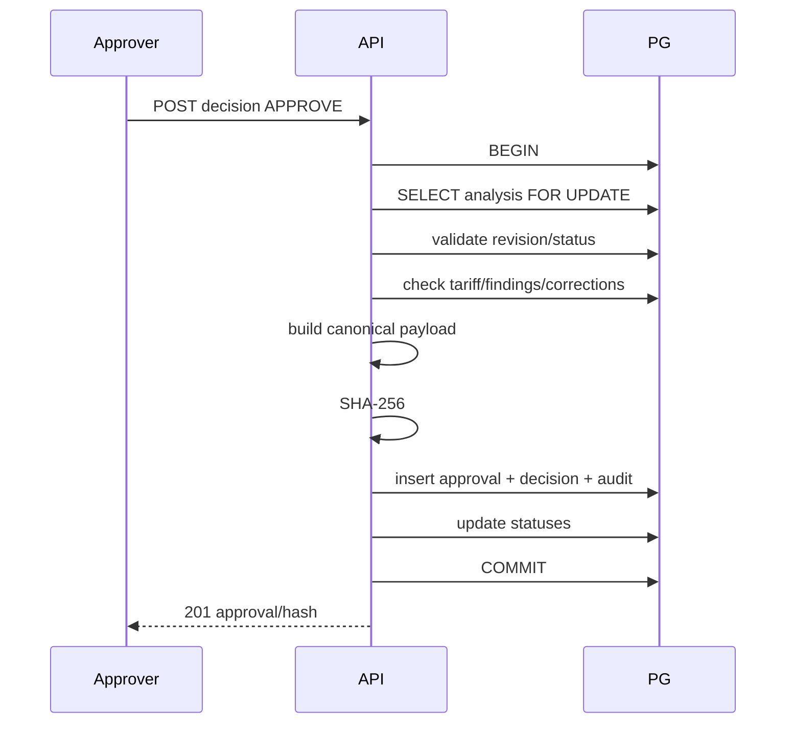

---

# 10. Export

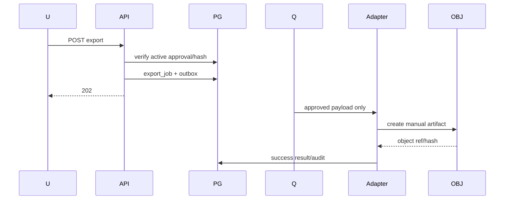

---

# 11. Approval revoke

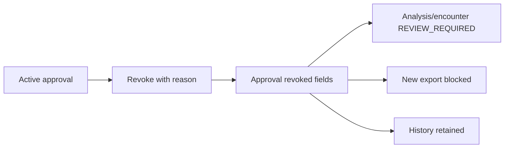

---

# 12. Encounter state

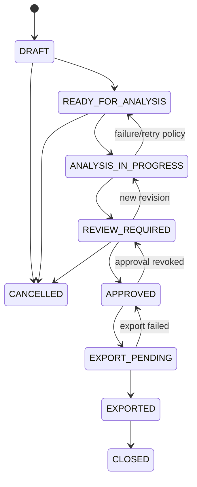

---

# 13. Analysis state

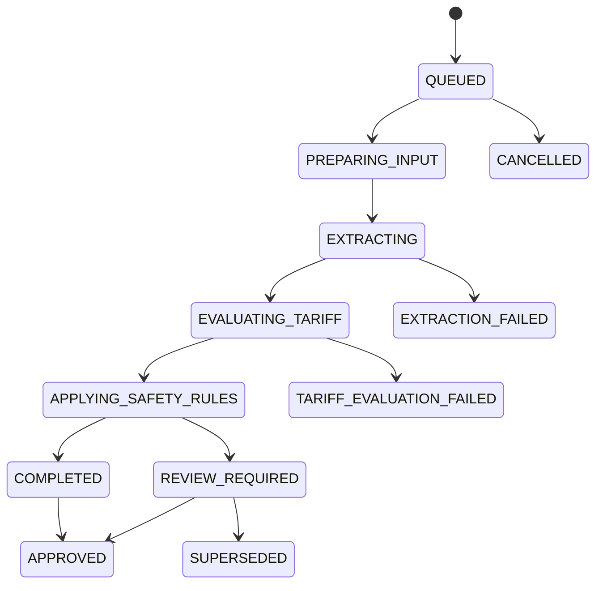

---

# 14. Data lineage

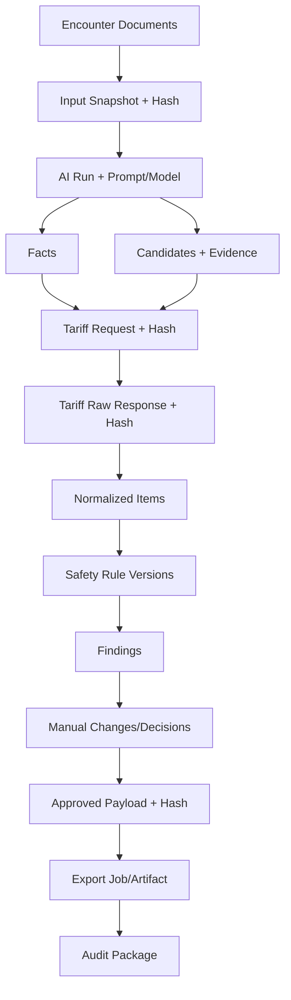
