# 14 — Data Flow and Sequence Diagrams

Mermaid dijagrami služe kao tehnički vodič. Kod/state machine i autoritativni dokumenti imaju prednost ako dođe do razlike.

---

# 1. Sistem

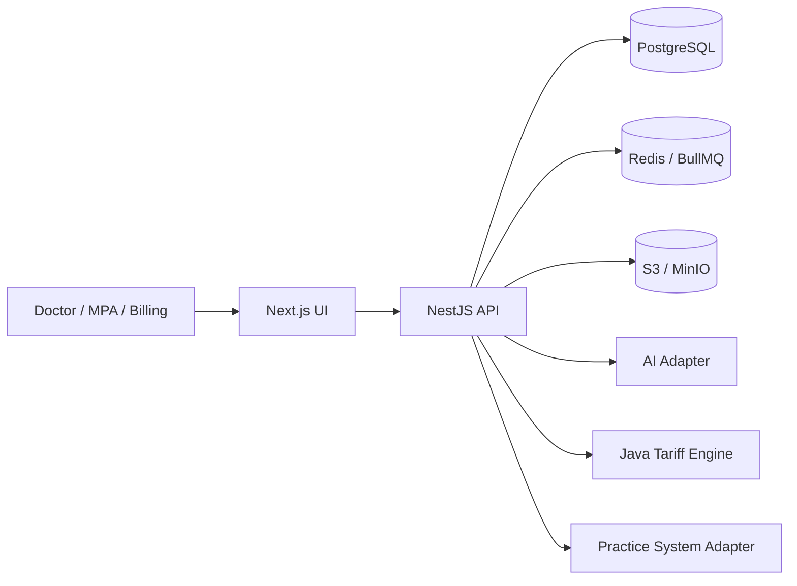

---

# 2. Tenant request

Normativno: D-033 i **D-047**; `02` §16.2.1, §16.2.4, §17.3, §17.5 i §17.6; `03` §3 i §3.7.1;
`04` §5.2 i §6.2; `07` Faze 3 i 4.

Cijeli lanac se izvršava u **jednoj interaktivnoj transakciji** (D-047, klauzula 8).

```mermaid
sequenceDiagram
    participant UI
    participant Guard
    participant Auth as AuthService
    participant TenantDB
    participant PG

    UI->>Guard: Bearer token + X-Practice-ID
    Guard->>Auth: validate bearer token
    Note right of Auth: signature, issuer,<br/>audience, expiry

    alt bearer invalid
        Auth-->>UI: 401 AUTHENTICATION_REQUIRED
    else bearer valid
        Auth->>PG: BEGIN
        Auth->>PG: set_auth_subject_context(p_auth_subject text)
        Note right of PG: PHASE 3 — app.auth_subject;<br/>clears app.user_id + app.practice_id
        Auth->>PG: select id, status from users
        Note right of PG: bootstrap policy 02 §17.5;<br/>no WHERE on auth_subject;<br/>at most one row

        alt unknown subject
            PG-->>Auth: 0 rows
            Auth->>PG: ROLLBACK
            Auth-->>UI: 403 ACCESS_DENIED
            Note right of Auth: valid token, unprovisioned subject;<br/>app.user_id never set;<br/>not INVALID_TOKEN
        else users.status <> ACTIVE
            Auth->>PG: ROLLBACK
            Auth-->>UI: 403 ACCESS_DENIED
            Note right of Auth: app.user_id never set;<br/>no membership enumeration
        else active user
            Auth->>PG: set_user_context(p_user_id uuid)
            Note right of PG: PHASE 3 — app.user_id;<br/>bootstrap policy self-deactivates
            Guard->>TenantDB: use case + requested practice id
            TenantDB->>PG: select status from practices where id = requested
            Note right of PG: PHASE 3 — membership policy 02 §17.6;<br/>pre-context read

            alt no membership for requested practice
                PG-->>TenantDB: 0 rows
                TenantDB->>PG: ROLLBACK
                TenantDB-->>UI: 403 ACCESS_DENIED
            else practice.status <> ACTIVE
                TenantDB->>PG: ROLLBACK
                TenantDB-->>UI: 403 ACCESS_DENIED
                Note right of TenantDB: app.practice_id never set
            else practice ACTIVE
                TenantDB->>PG: set_request_context(p_practice_id uuid)
                Note right of PG: PHASE 4 — SECURITY INVOKER<br/>user-scoped practice_memberships RLS

                alt no active membership
                    PG-->>TenantDB: 42501
                    TenantDB->>PG: ROLLBACK
                    TenantDB-->>UI: 403 ACCESS_DENIED
                    Note right of TenantDB: app.practice_id never set;<br/>no tenant query executed
                else active membership
                    PG-->>TenantDB: app.practice_id set
                    Note right of PG: practices visibility narrows<br/>to exactly this practice (RESTRICTIVE)
                    TenantDB->>PG: load roles + derive permissions
                    TenantDB->>PG: tenant queries
                    TenantDB->>PG: audit / outbox
                    TenantDB->>PG: COMMIT
                    TenantDB-->>UI: result
                end
            end
        end
    end

    Note over TenantDB,PG: transaction end clears app.auth_subject, app.user_id and app.practice_id;<br/>pooled connection inherits no context
```

**Granica faza (D-047, klauzula 16).** Koraci označeni `PHASE 3` pripadaju paketu
`002_identity_and_practices`; koraci označeni `PHASE 4` pripadaju paketu `013_rls_policies`. U
fazi 3 `set_request_context` još ne postoji, pa `app.practice_id` nikada nije postavljen — tenant
sužavanje se u toj fazi **dodatno** sprovodi aplikacijski, a RESTRICTIVE politika iz `02` §17.6
je već prisutna i aktivira se automatski čim faza 4 počne postavljati kontekst. Faza 3 je
**nepilotsko međustanje**; faza 4 ostaje obavezan sigurnosni gate prije faze 5.

## 2.1 Sigurnosna pravila (D-033, D-047)

- `set_request_context` **ne prima `user_id`**; nijedan caller-provided identifikator korisnika se ne smatra pouzdanim;
- **SECURITY DEFINER se ne koristi za tenant bootstrap**, niti za identity bootstrap — nijedna
  `SECURITY DEFINER` funkcija ne postoji u modelu (D-047, klauzula 2);
- `app.auth_subject` dolazi **isključivo** iz kriptografski verifikovanog JWT/OIDC subjekta, nikada
  iz bodyja, query parametra ni nepouzdanog headera;
- `set_auth_subject_context` briše `app.user_id` i `app.practice_id` prije postavljanja subjekta;
- bootstrap politika nad `users` sadrži uslov `app.user_id IS NULL`, pa se sama deaktivira nakon
  `set_user_context`; zastarjeli `app.auth_subject` nema efekta;
- `users` i `practices` nose `ENABLE` + `FORCE RLS` uz **column-level** grantove; `auth_subject`,
  `last_login_at`, `zsr_number`, `gln_number` i `legal_name` nemaju grant;
- ordinacija čiji `status` nije `ACTIVE` odbija se **prije** nego `app.practice_id` postoji;
- korisnik čiji `status` nije `ACTIVE` odbija se **prije** `set_user_context`;
- verifikovan auth subjekt bez `users` reda odbija se sa `403 ACCESS_DENIED` uz `ROLLBACK`,
  takođe **prije** `set_user_context`; `401 INVALID_TOKEN` ostaje rezervisan za neuspjelu
  verifikaciju tokena, a odgovor **ne razlikuje** nepoznat subjekt od ne-`ACTIVE` korisnika;
- **RLS ne autentifikuje korisnika** kada je dijeljeni `copilot_app` credential ukraden — držalac
  credentiala može sam postaviti `app.*` varijable; preživljavaju column grantovi, nepostojanje
  write grantova, nepostojanje vlasništva i `NOBYPASSRLS` (D-047, klauzula 20);
- SECURITY INVOKER **ne zaobilazi** `practice_memberships` RLS;
- membership bootstrap mora raditi **prije nego `app.practice_id` postoji**;
- normalna tenant RLS ne može bootstrap-ovati kontekst koji sama zahtijeva;
- `practice_memberships` koristi posebnu user-scoped bootstrap politiku;
- `X-Practice-ID` sam po sebi **ne autorizuje** tenant pristup;
- neuspjeh bootstrapa ne ostavlja upotrebljiv `app.practice_id`, a tenant upiti se ne izvršavaju;
- transakcijski lokalni kontekst ne curi u drugi request ni u pooled konekciju;
- `platformRoles` i tenant membershipi su **odvojeni**; `platformRoles` ne kreiraju tenant pristup;
- platform/system context se **ne** uspostavlja kroz `set_request_context`.

## 2.2 Napomena — access model za `users` i `practices` (D-047)

Opšti runtime pristup nad `users` i `practices` **riješen je odlukom D-047** (2026-08-12);
D-OPEN-011 nosi status `SUPERSEDED BY D-047`.

Dijagram iznad **ne implicira** neograničen pristup tim tabelama i nikada ga nije implicirao:

- čitanje `users` je ograničeno na **jedan red** — bootstrap po verifikovanom subjektu ili vlastiti
  red — kroz dvije međusobno isključive politike (`02` §17.5);
- čitanje `practices` je ograničeno na **ordinacije vlastitog membership skupa** prije tenant
  konteksta, i na **tačno jednu** ordinaciju nakon njega (`02` §17.6);
- membership-bootstrap tok iz §2 i dalje **nije** opšti pristup nad te dvije tabele — access model
  je riješen zasebnim politikama, ne proširenjem tog toka;
- pristup redu **drugog** korisnika ostaje `DENY / NOT IMPLEMENTED` u v1; obavezan gate je
  `BEFORE PHASE 5 CO-MEMBER DISPLAY NAME ACCESS` (`13` §19). Dijagrami u ovom dokumentu ga
  **ne prikazuju** i ne smiju ga anticipirati.

---

# 3. Create encounter

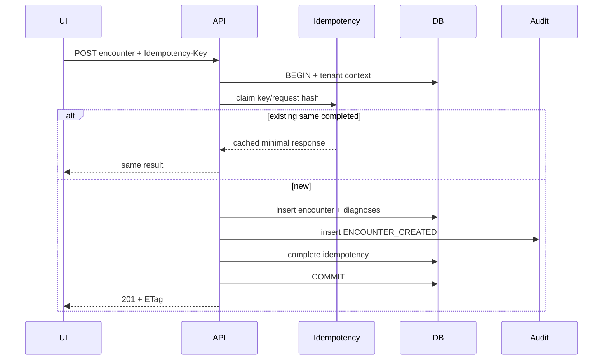

---

# 4. Document intake

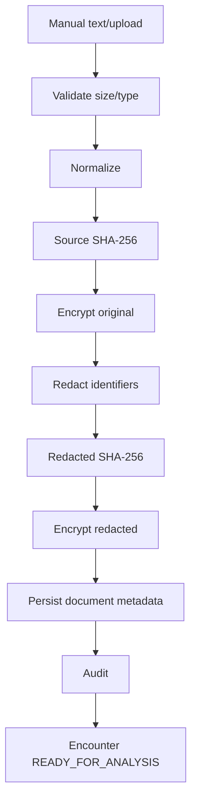

---

# 5. Analysis command/outbox

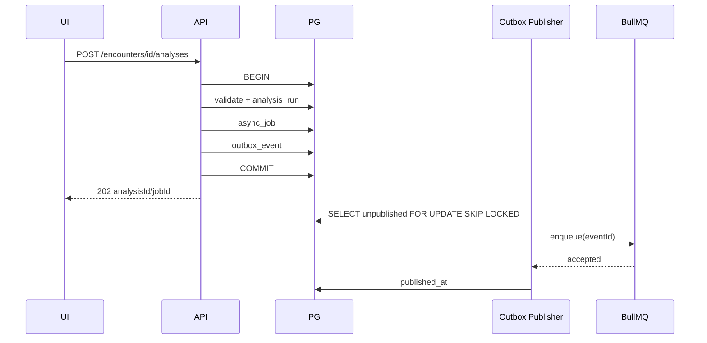

---

# 6. Analysis pipeline

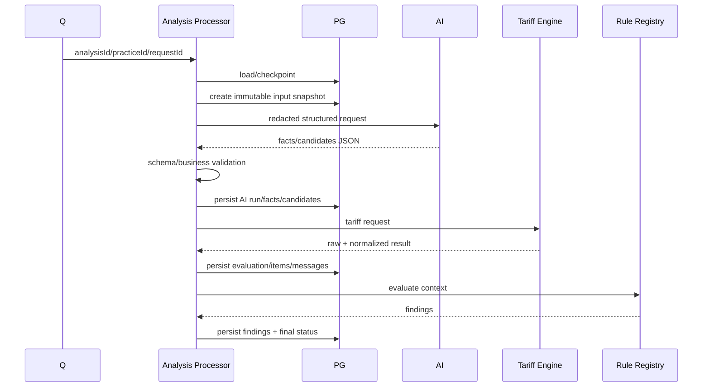

---

# 7. Retry checkpoint

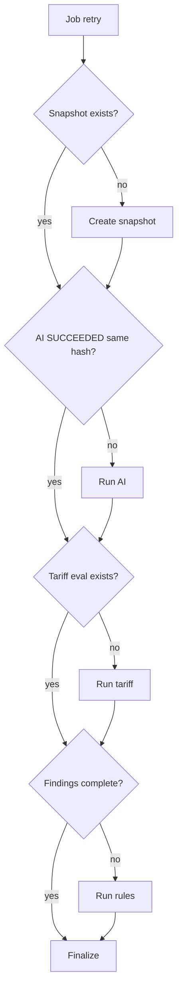

---

# 8. Review/correction

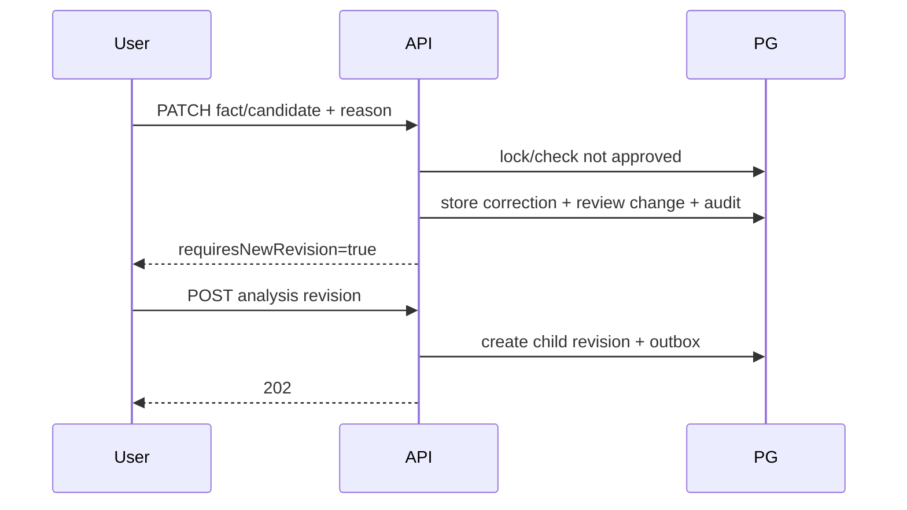

---

# 9. Approval

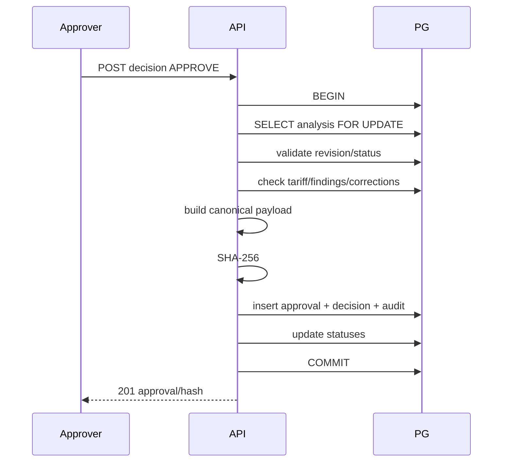

---

# 10. Export

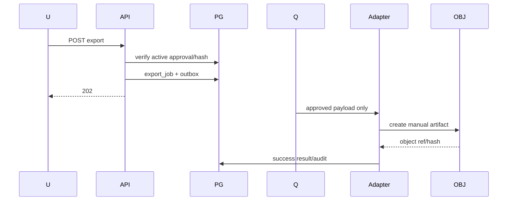

---

# 11. Approval revoke

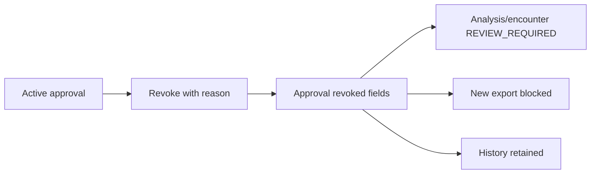

---

# 12. Encounter state

Normativni izvor: `03` §29.1 (D-027). Ovaj dijagram ga preslikava; u slučaju neslaganja
vrijedi `03` §29.1.

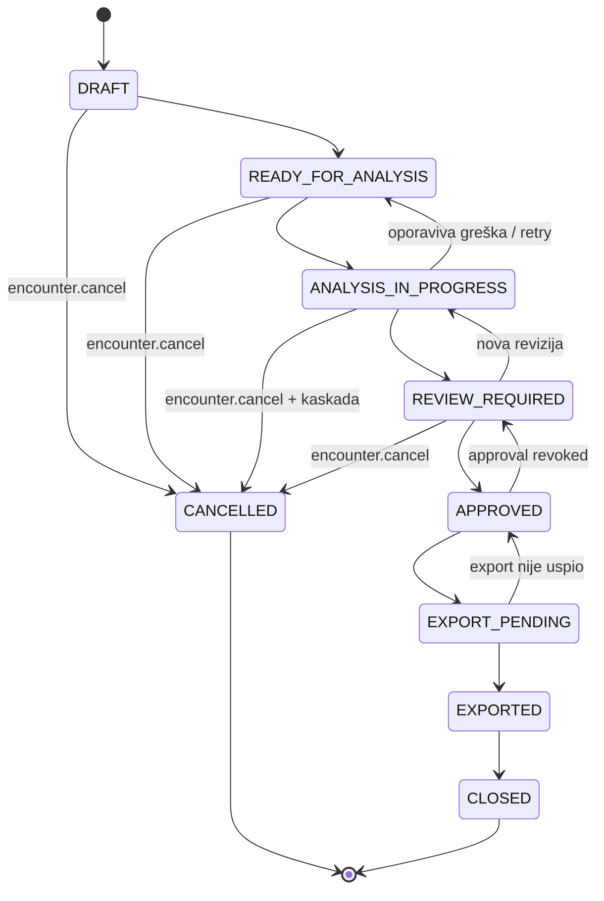

## 12.1 Kaskadno otkazivanje iz `ANALYSIS_IN_PROGRESS` (D-035)

Tranzicija `ANALYSIS_IN_PROGRESS → CANCELLED` je **atomarna kaskada**:

- prvo se otkazuje **tekuća aktivna analiza**, zatim encounter;
- `encounter.cancel` autorizuje kompletnu komandu i njenu internu kaskadu;
- `analysis.cancel` se **ne traži dodatno**;
- ako otkazivanje analize ne uspije, **kompletno otkazivanje encountera se rollback-uje** —
  djelimičan ishod nije dozvoljen;
- upisuju se **dva odvojena audit eventa** — jedan za analizu, jedan za encounter;
- **historijske i terminalne analysis revizije ostaju nepromijenjene**.

## 12.2 Eksplicitna pravila (`03` §29.1)

- **`CANCELLED → CLOSED` nije dozvoljen.** `CANCELLED` i `CLOSED` su oba terminalna.
- Ne postoji `ANALYSIS_IN_PROGRESS → APPROVED`. I analiza bez findinga prolazi kroz
  `REVIEW_REQUIRED`; ljudski review se ne preskače.
- `REJECT` odluka nad analizom **ne mijenja** encounter status — ostaje `REVIEW_REQUIRED`.

---

# 13. Analysis state

Normativni izvor: `03` §29.2 (D-031). Ovaj dijagram ga preslikava; u slučaju neslaganja
vrijedi `03` §29.2.

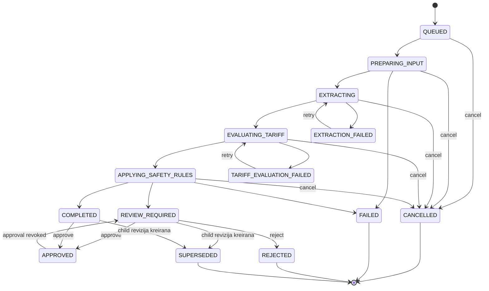

Terminalna stanja: `CANCELLED`, `FAILED`, `REJECTED`, `SUPERSEDED`.

Retry se uvijek vraća na svoj korak, nikada naprijed. Generički `FAILED` **nema** automatsku
retry tranziciju — stage oporavka nije poznat, pa oporavak traži novu reviziju.

## 13.1 Kreiranje revizije i linearni lanac (D-031 klauzula 8, D-034)

Kreiranje child revizije nije uvijek tranzicija roditelja. Za dio dozvoljenih roditelja
roditelj **zadržava** svoj status, pa se to ne crta kao tranzicija u §13.

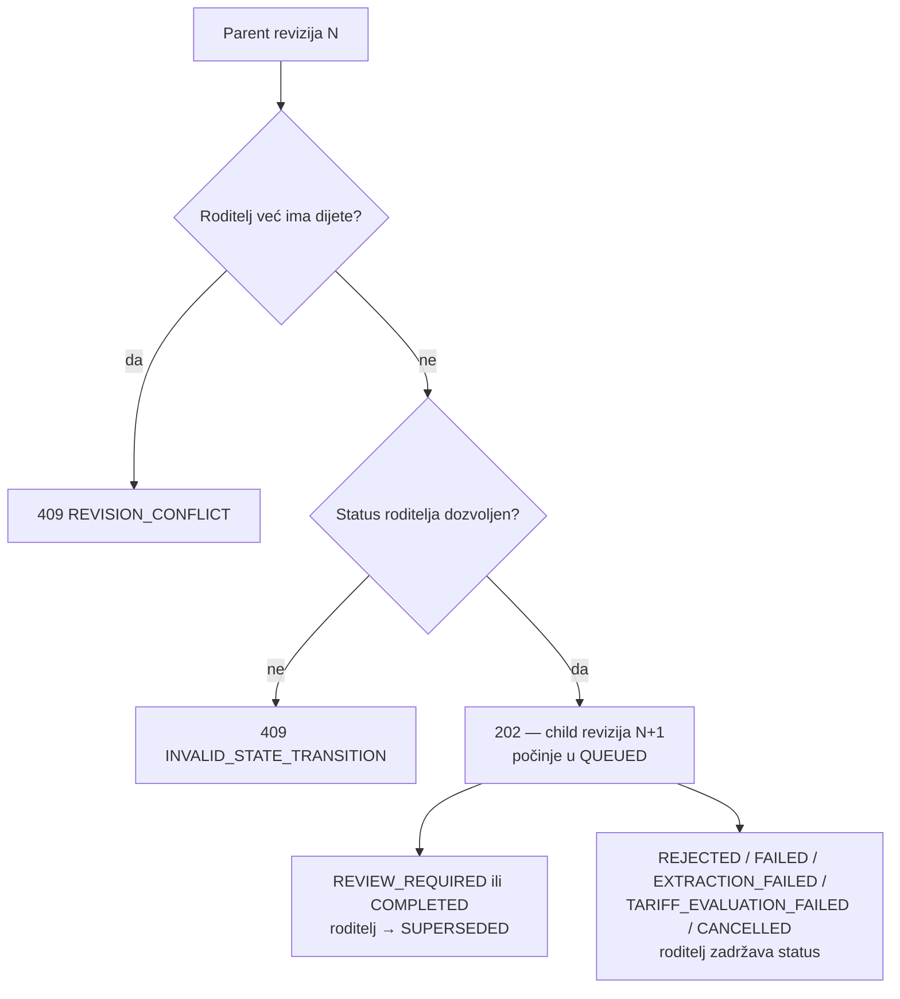

**Provjera postojanja djeteta prethodi validaciji statusa roditelja** (D-034). Zbog toga je
kod greške deterministički i ne zavisi od statusa roditelja.

Linearni lanac:

- historija revizija je **linearni lanac, ne stablo**;
- svaki roditelj ima **najviše jedno direktno dijete**;
- `revisionNumber` djeteta je `roditelj.revisionNumber + 1`;
- dijete počinje u `QUEUED`;
- **retry nikada ne kreira reviziju N+2** od istog roditelja;
- `parentAnalysisRunId` i `revisionNumber` su immutable nakon INSERT-a.

Nedozvoljeni roditelji: `QUEUED`, `PREPARING_INPUT`, `EXTRACTING`, `EVALUATING_TARIFF`,
`APPLYING_SAFETY_RULES`, `SUPERSEDED` i `APPROVED`. `APPROVED` mora prvo biti revoked u
`REVIEW_REQUIRED` (§11).

## 13.2 Otkazivanje analize (D-035)

Direktno otkazivanje kroz `POST /analyses/{id}/cancel`:

| Slučaj | Status | Ponašanje |
|---|---:|---|
| aktivno async stanje | `202` | analiza prelazi u `CANCELLED` |
| analiza je već `CANCELLED` | `200` | postojeća reprezentacija, **bez promjene stanja** |
| drugo neaktivno ili terminalno stanje | `409` | `INVALID_STATE_TRANSITION`, bez promjene stanja |

Aktivna async stanja: `QUEUED`, `PREPARING_INPUT`, `EXTRACTING`, `EVALUATING_TARIFF`,
`APPLYING_SAFETY_RULES`.

**Ponovljeno otkazivanje ne kreira dodatni audit event.** Audit event se upisuje isključivo
pri stvarnom prelasku u `CANCELLED`. Zato `CANCELLED → CANCELLED` **nije** tranzicija i ne
crta se u §13.

---

# 14. Data lineage

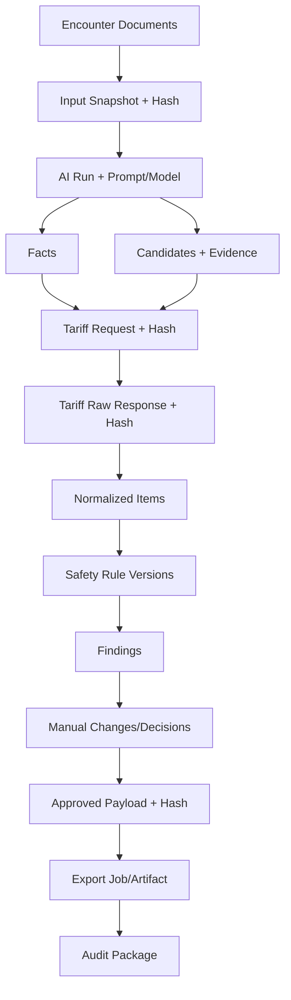
