# 14 — Data Flow and Sequence Diagrams

Mermaid dijagrami služe kao tehnički vodič. Kod/state machine i autoritativni dokumenti imaju prednost ako dođe do razlike.

---

# 1. Sistem

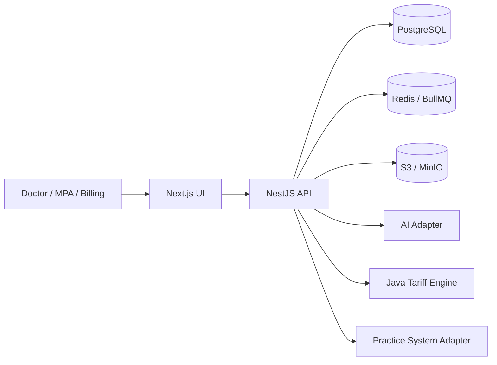

---

# 2. Tenant request

Normativno: D-033; `02` §16.2 i §17.3; `03` §3; `04` §6.2; `07` Faza 4.

```mermaid
sequenceDiagram
    participant UI
    participant Guard
    participant Auth as AuthService
    participant TenantDB
    participant PG

    UI->>Guard: Bearer token + X-Practice-ID
    Guard->>Auth: validate bearer token
    Note right of Auth: signature, issuer,<br/>audience, expiry

    alt bearer invalid
        Auth-->>UI: 401 AUTHENTICATION_REQUIRED
    else bearer valid
        Auth->>Auth: resolve authenticated users.id
        Guard->>TenantDB: use case + requested practice id
        TenantDB->>PG: BEGIN
        TenantDB->>PG: set_user_context(p_user_id uuid)
        Note right of PG: app.user_id — transaction-local
        TenantDB->>PG: set_request_context(p_practice_id uuid)
        Note right of PG: SECURITY INVOKER<br/>user-scoped practice_memberships RLS

        alt no active membership
            PG-->>TenantDB: 42501
            TenantDB->>PG: ROLLBACK
            TenantDB-->>UI: 403 ACCESS_DENIED
            Note right of TenantDB: app.practice_id never set;<br/>no tenant query executed
        else active membership
            PG-->>TenantDB: app.practice_id set
            TenantDB->>PG: tenant queries
            TenantDB->>PG: audit / outbox
            TenantDB->>PG: COMMIT
            TenantDB-->>UI: result
        end
    end

    Note over TenantDB,PG: transaction end clears app.user_id and app.practice_id;<br/>pooled connection inherits no context
```

## 2.1 Sigurnosna pravila (D-033)

- `set_request_context` **ne prima `user_id`**; nijedan caller-provided identifikator korisnika se ne smatra pouzdanim;
- **SECURITY DEFINER se ne koristi za tenant bootstrap**;
- SECURITY INVOKER **ne zaobilazi** `practice_memberships` RLS;
- membership bootstrap mora raditi **prije nego `app.practice_id` postoji**;
- normalna tenant RLS ne može bootstrap-ovati kontekst koji sama zahtijeva;
- `practice_memberships` koristi posebnu user-scoped bootstrap politiku;
- `X-Practice-ID` sam po sebi **ne autorizuje** tenant pristup;
- neuspjeh bootstrapa ne ostavlja upotrebljiv `app.practice_id`, a tenant upiti se ne izvršavaju;
- transakcijski lokalni kontekst ne curi u drugi request ni u pooled konekciju;
- `platformRoles` i tenant membershipi su **odvojeni**; `platformRoles` ne kreiraju tenant pristup;
- platform/system context se **ne** uspostavlja kroz `set_request_context`.

## 2.2 Napomena — D-OPEN-011

Opšti runtime pristup nad `users` i `practices` je **neriješen**. Membership-bootstrap tok iz §2
**ne rješava** taj pristup, a dijagrami ne impliciraju neograničen pristup tim tabelama.

---

# 3. Create encounter

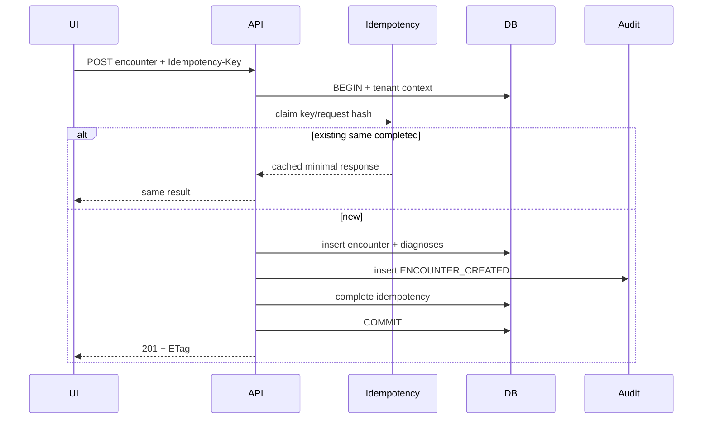

---

# 4. Document intake

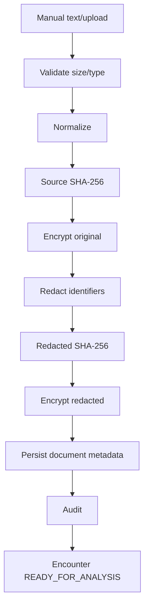

---

# 5. Analysis command/outbox

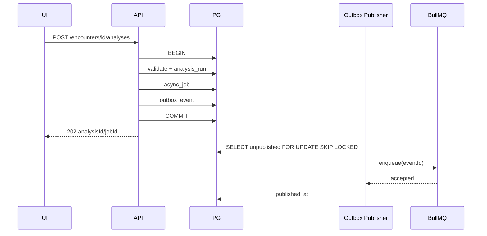

---

# 6. Analysis pipeline

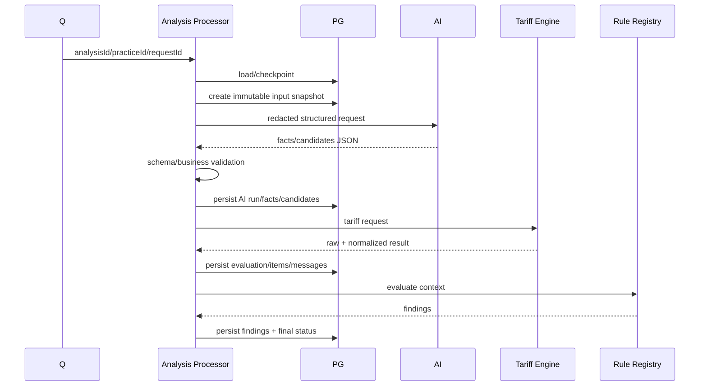

---

# 7. Retry checkpoint

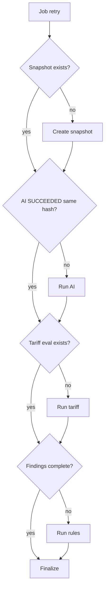

---

# 8. Review/correction

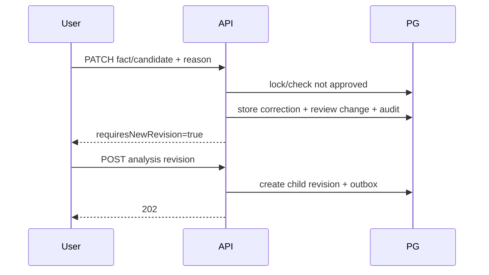

---

# 9. Approval

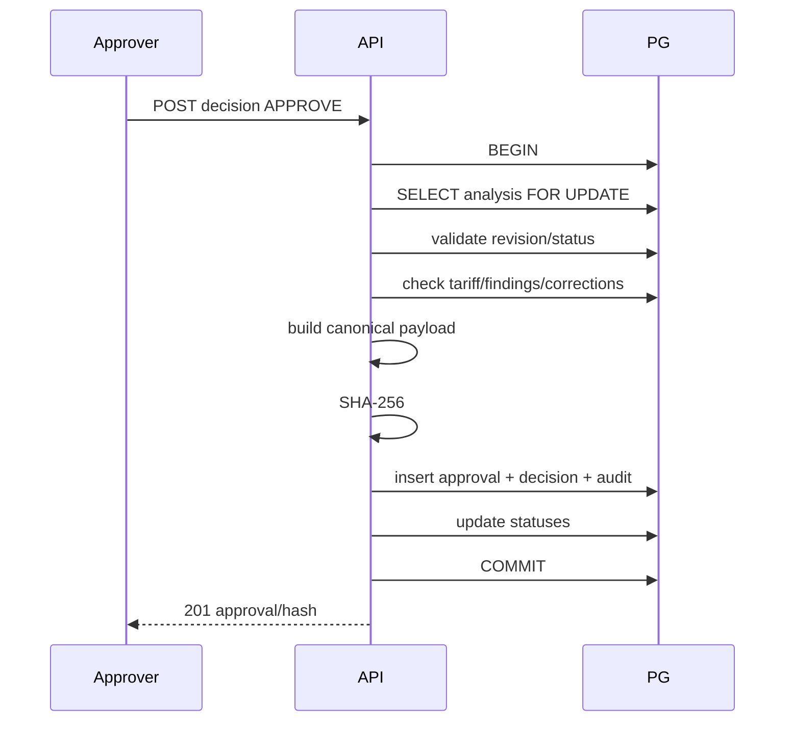

---

# 10. Export

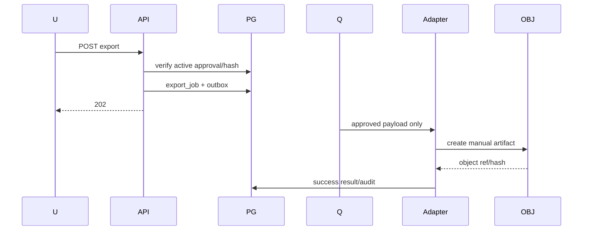

---

# 11. Approval revoke

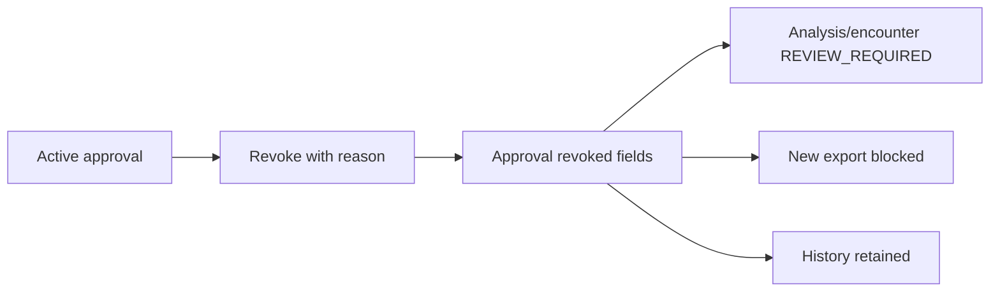

---

# 12. Encounter state

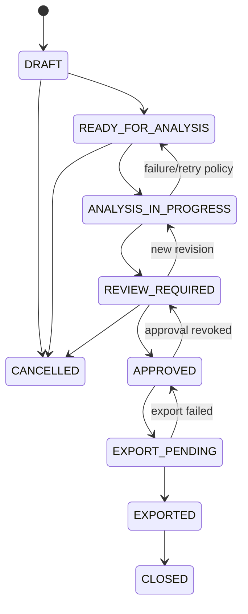

---

# 13. Analysis state

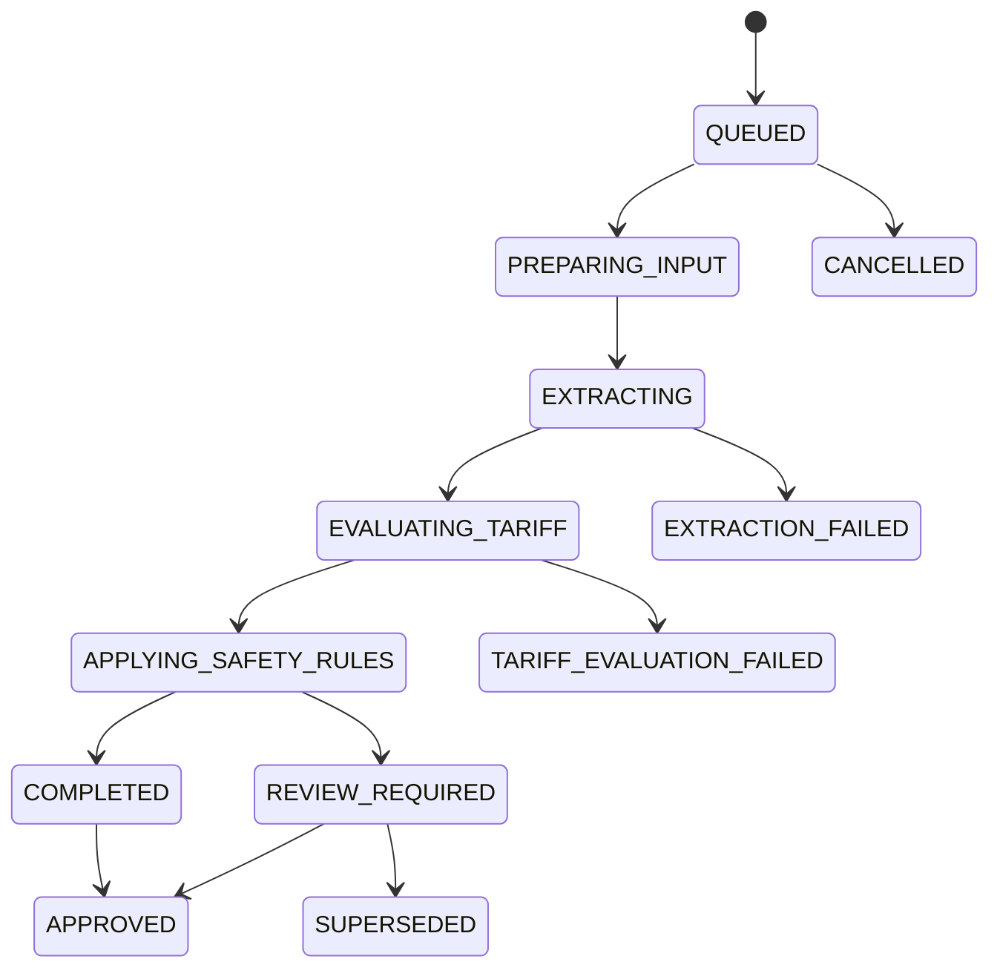

---

# 14. Data lineage

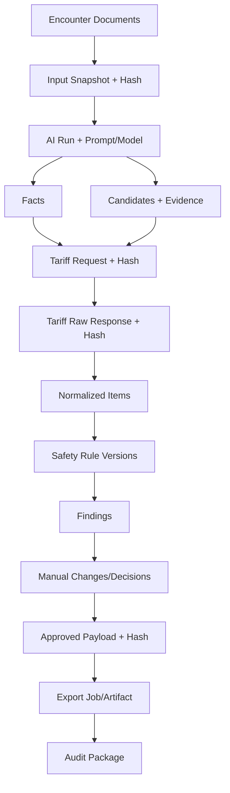
